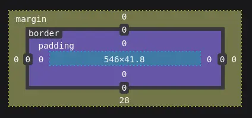
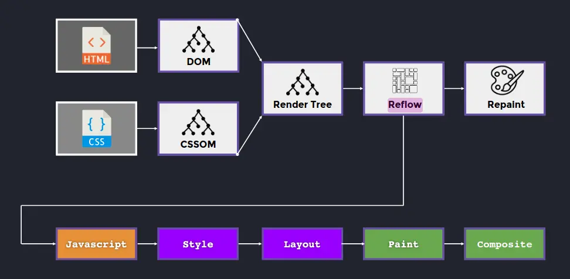
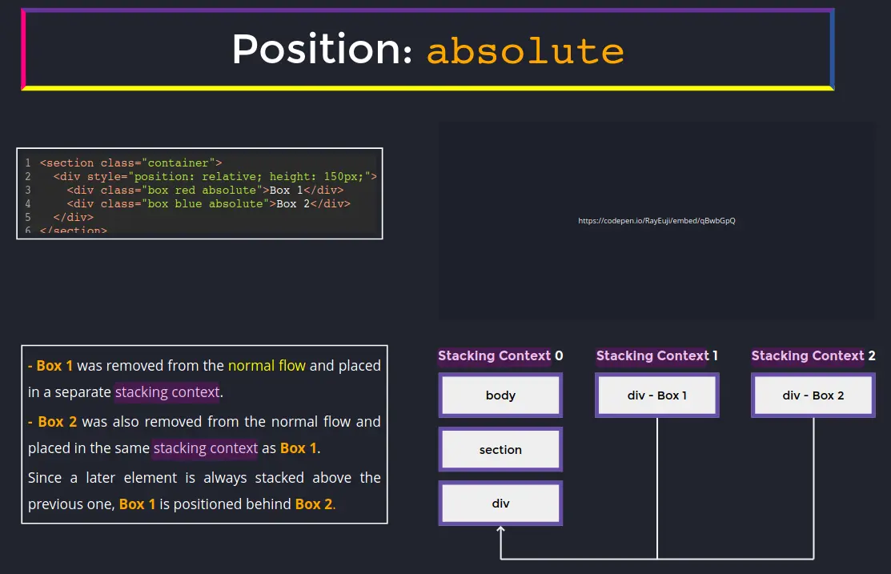
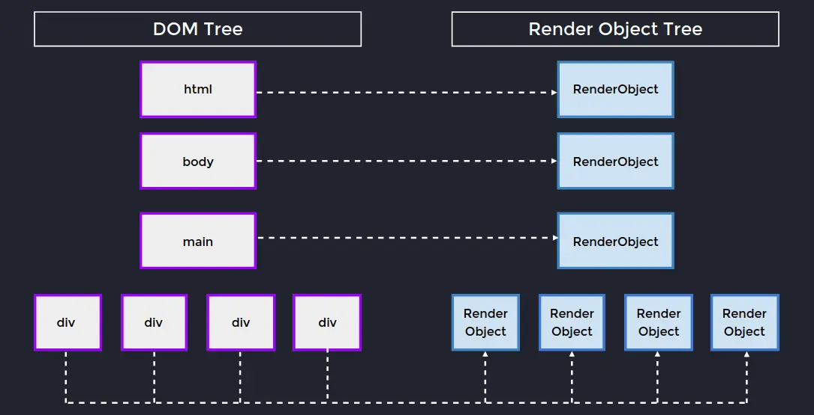
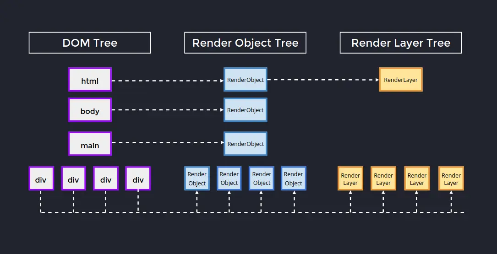
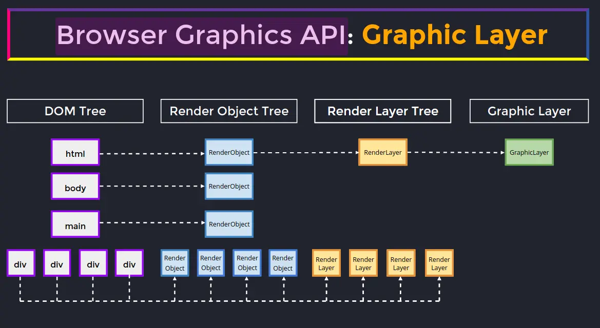

<!-- markdownlint-disable MD007 MD010 MD013 MD024 MD028 MD033 -->
The browser has a few systems that are directly affected by our HTML, CSS, and JavaScript, and if we're not careful, we can create very memory-heavy, CPU-intensive DOM trees; and once we have an inefficient DOM tree, the browser has to maintain it and every new DOM manipulation or style change can lead to slow, janky updates.

First and foremost, we need to understand how the browser calculates an elements position, and that's by use of the "box model," which is used by the browser to calculate the dimensions of an element and where it fits into the browser formatting context(s), which we'll also cover below.

## Box Model

4 Layers (innermost to outtermost):

1.	content-box
2.	padding-box
3.	border-box
4.	margin-box



<br>

The box model determines two main properties on every HTML element:

1.	Size
2.	Type

### Size

Two possible values:

> [!TIP] Intrinsic
> The box content determines the spaces it occupies

> [!TIP] Restricted
> The box's size is governed by a set of rules:
> - CSS (width and height)
> - Constraint from its parent context or other boxes:
>     - flex or grid layout systems
>     - % of parent size
>     - aspect-ratio if an image
>     - Other siblings

### Type

Three possible values:

> [!TIP] Block level
> Including, but not restricted by `display: block` 

> [!TIP] Inline  level
> `display: inline`

> [!TIP] Anonymous 
> box

#### Box type: block

-	Takes 100% of parent context's width
-	Height is equivalent to its content (intrinsic)
-	Rendered from top to bottom
-	Governed by **Block Context Formatting** (BCF)

> [!INFO] Block Context Formatting
> Subsystem of the Browser Formatting Context system; vertically and horizontally organizes the block contexts of the DOM tree. [Read more](#browser-formatting-context)

##### Calculating the width of a block element

Depending on the CSS `box-sizing` property value, the width calculation is different. 

<br>

When `box-sizing: content-box`, each layer of the box model needs to be calculated to get the accurate width of the element.

```scss
// Psuedo code
box-sizing: content-box;
width: calc(margin-left + border-left + padding-left + content-width + padding-right + border-right + margin-right);
```

When `box-sizing: border-box`, the content portion of the box wraps the border, padding, and content layer into one layer, simplifying the calculation.

```scss
// Psuedo code
box-sizing: border-box;
width: calc(margin-left + content-width + margin-right);
```

##### Block type HTML elements (not an exhaustive list)

`address, article, aside, blockquote, canvas, div, figcaption, figure, footer, form, h1-h6, header, hr, li, main, nav, noscript, ol, p, pre, section, table, ul, video`

#### Box type: inline

-	Rendered like a string, from left to right and top to bottom
-	Governed by **Inline Formatting Context** (IFC)
-	Generate inline-level boxes

> [!INFO] Inline Formatting Context
> Subsystem of the Browser Formatting Context system; horizontally organizes the inline contexts of the DOM tree. [Read more](#browser-formatting-context)

##### Calculating the width of an inline element

-	Inline elements **do not** respond to `width` and `height` properties (literally, it does not affect their size)
-	Inline elements **do not** react to vertical margins
-	Inline elements' padding does not alter their height

```scss
width: calc(margin-left + border-left + padding-left + content-width + padding-right + border-right + margin-right);
```

##### HTML tags that are inline type boxes (not an exhaustive list)

`a, acronym, abbr, br, button, i, img, input, object, q, small, span, strong, time, b, code, em, label, select, textarea`

#### Box type: anonymous

Anonymous (inline) boxes are any text directly contained inside a block container element.

```html
<div>
    I am treated as an anonymous inline element
    because I'm directly inside of a block container element.
</div>
```

> [!WARNING]
> This is considered a bad practice because it's not semantic; therefore, it's not accessible.

## Reflow



Reflow refers to the process of recalculating elements' positioning in the DOM after the original render. It is a process of combining HTML, CSS, and JavaScript to display something on the page; however, it's unique in that it only happens when the original DOM rendering changes, such as being updated with new elements or changing the order of existing elements.

> [!IMPORTANT]
> Reflow triggers when the browser needs to recalculate the position or geometry of any part of the DOM. Typically, this is followed by repainting.

> [!INFO] Repainting
> Repainting is the process by which the browser draws every element in the DOM.

### Normal DOM rendering process

1.	HTML is converted into a DOM tree; CSS is converted into a CSSOM tree
2.	The DOM and CSSOM are combined into a render tree
3.	Reflow
4.	Repaint

### Reflow

By default, reflow goes through all five of the following steps; however, by utilizing certain JavaScript and CSS techniques, we can reduce default pipeline down to what we'll call the "optimized" pipeline.

1.	JavaScript (DOM manipulations)
2.	Style (CSS changes)
3.	Layout (recalculating the layout)
4.	Paint (displaying/updating the new layout on the page)
5.	Composite

Optimized pipeline:

1.	Paint
2.	Composite

#### Example of triggering the default pipeline

This causes the entire page layout to recalculate because margin affects page layout, so every element's position needs to be recalculated.

```css
@keyframes moving-down-slow {
    from {
        margin-top: 0;
    }
    to {
        margin-top: 500px;
    }
}
```


#### Techniques to utilize the optimized pipeline

- Minimize the number of DOM manipuations (via JavaScript) that cause the first three steps in the reflow process
- Utilize CSS and DOM manipulations that create new stacking contexts

```js
// Utilizing the DocumentFragment to append multiple children trigging one reflow
// vs appending each child one at a time, triggering many reflows
const fragment = new DocumentFragment()
const target = document.getElementById("target")

for (const datum of data) {
    const card = createNewCardElement(datum)

    fragment.appendChild(card)
}

target.appendChild(fragment)
```

<br>

```css
/*
 * This example does not trigger the "javascript," "style,"
 * or "layout" steps in the default pipeline 
 *
 * Since transform moves the element out of the normal flow and 
 * into a new stacking context, the normal flow is not required
 * to be recalculated when the element being transformed is... transformed.
*/

@keyframes moving-down-fast {
    from {
        transform: translateY(0px);
    }
    to {
        transform: translateY(500px);
    }
}
```

> [!INFO] Stacking Contexts
> Stacking Contexts are layers on top of the normal flow of the DOM tree (like `z-index`) where entire formatting contexts can exist and be manipulated without triggering reflows in the normal flow, or the original stacking context. [Read more](#stacking-context)

## Browser Formatting Context

Pleaes look at pages 18-27 in the [slides](https://static.frontendmasters.com/resources/2024-05-29-systems-design/frontend-system-design-fundamentals.pdf#page=19). Exercise at pages 29-39 in the [slides](https://static.frontendmasters.com/resources/2024-05-29-systems-design/frontend-system-design-fundamentals.pdf#page=29).

### Key ideas behind BFC

> [!TIP] Isolation
> Elements within a context are shielded from the rules of external contexts

> [!TIP] Scalability
> Introducing a new ruleset for eleme[nts is as simple as creating new **Contexts** (flex-box, grid, etc.)

> [!TIP] Predictability
> With a strict rule set, the placement of elements is predictable

## Stacking context

Without CSS, all page layouts would operate on the X and Y axis, meaning everything would be placed on a single layer. However, when we apply CSS 3D transformations, absolute positioning, or any action that moves an element from the normal flow, we active an additional axies known as the **stacking context** or the Z axis. Child elements of a stack context are stacked according to the same rules that create stacking contexts (i.e. stacking contexts can be within stacking contexts).



Stacking contexts are an incredible browser feature:

-	**Layering**: we need a way to represent layers in our layouts
-	**Performance optimization**:
	-	Elements removed from the normal flow are placed into a new stacking context
        - Only descendant elements are moved into the stacking context
	-	Modifications to every element within a separate stacking context do not impact any other elements within the normal flow
	-	All CSS transformations are GPU accelerated, meaning the browser doesn't need to recalculate the DOM tree when such operations are performed. This minimizes the reflow cycle, and number of reflows as we update the DOM

Stack contexts are created:

- Root element of the document (`<html>`)
- Position of "absolute" or "relative" and `z-index !== auto`
- Position of "fixed" or "sticky"
- `container-type` value of "size" or "inline-size"
- Child of a flex container and `z-index !== auto`
- Child of a grid container and `z-index !== auto`
- Opacity less than 1
- `mix-blend-mode` value other than "normal"
- Any of the following CSS properties with a value other than "none"
    - transform
    - scale
    - rotate
    - translate
    - filter
    - backdrop-filter
    - perspective
    - clip-path
    - mask / mask-image / mask-border
- Isolation value "isolate"
- `will-change` value
- `contain` value of "layout," "paint," or a composite value including either "layout" or "paint"
- Has stacking context-creating properties animated using `@keyframes` with `animation-fill-mode` set to "forwards"

## Browser Positioning System

> [!INFO] Normal Flow
> Top to bottom; right to left || left to right

Certain CSS properties alter an elements positioning on the page in a way that changes the normal flow of the DOM.

### Position

Position determines a variant of an element's positioning on the page, relative to the browser window or an anchor element.

`position: static | fixed | relative | absolute | sticky`

If positioning is used wisely, we can achieve:

-	**Isolation**: modifications made to elements positioned in this way will not affect other elements within the normal flow (i.e. avoids reflows)
-	**Performance optimization**: positioning plays a key role in optimizing and minimizing updates to the DOM tree

#### Containing blocks

A containing block is the anchor to which `top, right, bottom, left` apply to an explicitly positioned element. By default, it's the browser viewport (window); however, there are two rules that take precedent:

1.	If an element has `position: relative`, its closest **block-level** ancestor element is the containing block
2.	If an element has `position: relative`, it becomes a containing block

#### Relative

-	Element is positioned according to the normal flow of the document
	-	`offset` is applied relative to itself
-	`offset` does not affect the position of any other element; this, the space allocated for the element in the page layout remains the same as if the element's position was "static"
-	Creates a new **stacking context** when the value of `z-index` is not "auto"

#### Absolute

-	Element is removed from the normal document flow
-	No space is reserved for the element in the page layout
-	Element is positioned relative to its closest **positioned ancestor** if one exists; otherwise, it is placed relative to the browser viewport
-	Final position is determined by `top, right, bottom, left`
-	This positioning creats a new **stacking context** when the z-index value is not "auto"
	-	Review to page 47-50 of the [slides](#frontend-system-design) -

## Browser graphics API: render object

DOM tree nodes are converted into `RenderObject`s so the browser can utilize GPU accelerated rendering. Render objects contain the necessary information to render an object, and nothing else.

However, by themselves, render objects aren't efficient ways at rendering layouts because it would require rending thousands of tiny little elements. This is where **render layers** come in.



## Browser graphics API: render layer

Render layers are created according to a browser's formatting contexts and stacking contexts, and when render objects are created for individual stacking contexts, those objects are stored within the Render Layer as a linked list in stack order.



<br>

A **render layer** is constructed when an element:

-	Has explicit CSS properties:
	-	position: relative | absolute
	-	transform
-	It's the root of the page (`<html />`\)
-	It is transparent
-	Has a CSS filter
-	Corresponds to a `<canvas>` element that has a 3D (WebGL) context or an accelerated 2D context
-	Corresponds to a `<video>` element

However, the GPU is great at rendering thousands upon thousands of things, not hundreds, so there's another layer that comes into play to utilize render layers.

## Browser graphics API: graphic layer



A **graphic layer** is constructed when:

-	Render Layer has 3D or perspective transform CSS properties
-	Layer is used by:
	-	`<video>` element using accelerated video decoding
	-	`<canvas>` with 3D/2D context
-	Layer uses:
	-	CSS animation for `opacity`
	-	animated `web-kit transform`
-	Layer uses accelerated CSS filters
-	Layer has a descendant that is a **compositing layer**
-	Layer has a sibling with a lower `z-index` which has a compositing layer (i.e., a layer that overlaps a composited layer and should be rendered on top of it)

So, a graphic layer, or graphic layers in cases where 3D acceleration is being utilized by a render layer, will contain all the necessary information to draw the rendering layers.

### Caveats

Graphic layers are expensive objects to initialize because they use a lot of VRAM and CPU. Use them (3D acceleration, perspective transforms, opacity transformations, CSS filters, and composite layers) wisely.
