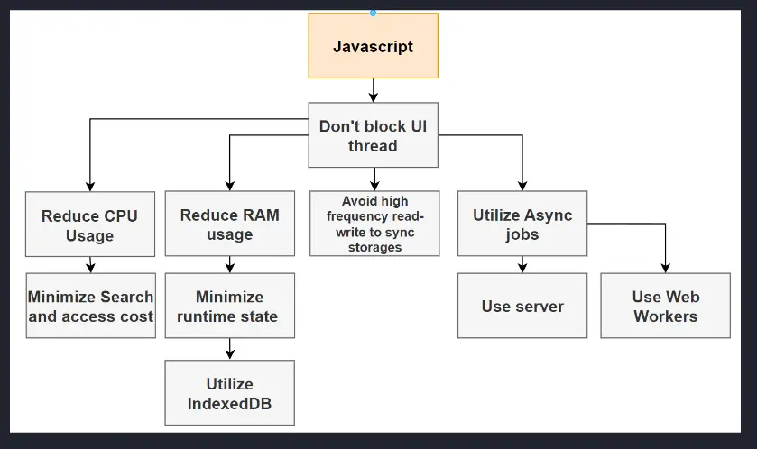
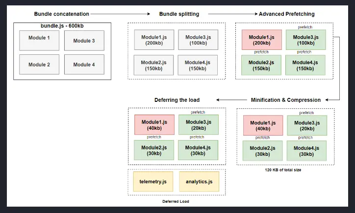

<!-- markdownlint-disable MD007 MD010 MD013 MD024 MD033 MD041 -->
> [!IMPORTANT] Golden rule for browser-based JavaScript
> Do not block the UI thread

> [!INFO] JavaScript bundling example of `matchAll`
> Core JS, the core of JavaScript's source code, is **243.9kb** minified, and **74.1kb** minified + gzipped.
>
> Guess the ES5 and ES2020 bundle size to utilize: `"FrontendMasters".matchAll(/Frontend/)`
>
> ::: details Toggle for answer!
> | Function | ES5 Bundle Size | ES2020 Bundle Size |
> |--|--|--|
> | `String.prototype.matchAll` | 16.9kb | 69b |
> :::

## Summary of optimizations

1. Reduce CPU usage
    1. Minimize access and search cost by utilizing Normalization of your data structures (2NF)
2. Reduce RAM usage
    1. Minimize running state by utilizing the Web Storage API and IndexedDB to offload state from the memory to the hard drive
3. Avoid high frequency read-write to synchronous storages, such as local and session storage
4. Utilize asynchronous jobs
    1. Server
    2. Web workers
5. Defer script loading and execution
6. Utilizing `DocumentFragment` for appending multiple items to the dom without causing O(N) reflows



## Overview of the performance gains by utilizing the below optimizations

There are four techniques we can use to optimizing our JavaScript bundles and improve page load performance. In order of implementation:

1. Code splitting
2. Minification and compression
3. Prefetching
4. Deferring execution



### Polyfills... do you actually need them?

- ES6 (2016) has support of 98.2% of browsers
    - constants
    - Array functions
    - Default parameters to functions
    - Destructuring
    - ES6 classes
    - Spread operator
    - New for loops
    - Variable and functional scopes
    - import and export
    - Variable declaration let and var
    - Multi-line strings
    - Object literal syntax
    - JavaScript Promise
- ES7-10 (2016 - 2019) has support of 96% of browsers
    - Array includes
    - ** exponential operator
    - Exponential assignment operator **=
    - Class properties
    - Promise finally block
    - Asynchronous iteration
    - REST/spread operator enhancement
    - Regexpression update
    - BigInt primitive type
    - Dynamic imports
    - JSON stringify enchanced to support unicode
    - Array.Flat methods
    - String.trim methods
    - Object.fromEntries
    - Global this object
    - toString()
    - `Symbol.prototype.description`
    - Optional catch binding
- ES11 (2020) - 90%
    - `Promise.allSettled`
    - Nullish Coalescing
    - Optional chaining operator
    - Private class variables
- ES12 (2021) - 89%
    - `String.prototype.replaceAll`
    - `WeakRefs`
    - Logical assignment operators 
    - Numeric separators
    - `Promise.any`

#### Multi-bundle approach

Process of compiling JavaScript into multiple bundles and enabling the server to serve the bundle most optimized based on the `user-agent`.

### Code splitting

Process of importing modules only when needed. Most bundling tools handle this automatically but provide somewhere to define custom splitting, such as [Vite](https://vitejs.dev).

Instead of having a concatenated bundle size of 1mb, we can split it into four modules of 250kb, or whatever, to reduce rendering performance and CPU and memory usage.

```ts
const cta = document.getElementById("next-button")

cta.addEventListener("click", async () => {
    const { render } = await import("./module.js")
    render(root)
})
```

#### Code pre-fetch

Browsers provide the ability to link to resources we want to preload in the background.

##### Preloads a resource in the background with a high priority
`<link rel="preload" href="./module1.js">`

##### Preloads and caches a resource in the background with a low priority
`<link rel="prefetch" href="./module2.js">`

### Code minification and compression

#### Minification

Process of simplify code syntax to remove unnecessary characters and shorten text to create smaller file sizes:

```ts
// Unminified
function Sum() {
    const longVAriableName = 2 + 2
    return longVAriableName
}

// Minified
function s(){return 2+2}
```

#### Compression

There are two compression options, but older browsers may limit the use of **brotli** over **gzip**.

| Library | Algorithm | Initial Size | Compressed | Ratio |
| --------------- | --------------- | --------------- | --------------- | --------------- |
| jquery-3.7.1.js | Brotli | 302kb | 69kb | 77% |
| jquery-3.7.1.js | gzip | 302kb | 83kb | 73% |
| jquery.3.7.1.min.js | Brotli | 85kb | 27kb | 68% |
| jquery.3.7.1.min.js | gzip | 85kb | 30kb | 65% |

**Brotli**, on average, is 20-30% faster than **gzip** but is less likely to be supported by older browsers.

**Gzip** is much faster and supported by most browsers.

### Defer script loading and execution

Deferred loading is the ability to asynchronously load javascript in the background and defer execution until the browser has finished parsing the DOM.

> [!INFO]
> `async` scripts execute once fully downloaded, regardless of whether the browser has finished parsing the DOM.
>
> `defer` scripts download asynchonously, but do not execute until the browser has finished parsing the DOM.

### Utilizing `DocumentFragment`

[Read more here](./dom-apis#use-of-documentfragment)
