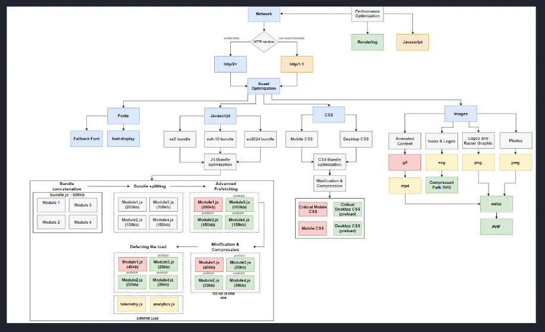

<!-- markdownlint-disable MD007 MD010 MD013 MD024 MD033 MD041 -->
Network optimizations are techinques to reduce the rendering impact from downloading assets, such as fonts, images, css, and javascript.

### Summary

1. Choose the right transfer protocol for your APIs
2. Optimize assets for production

### Choosing the right transfer protocol

Server protocol usage today:

- http/1.1 --> ~20%
- http/2 --> ~50%
- http/3 --> ~30%

#### HTTP/1.1

##### Loading efficiency limitation

Because of the DNS and triple handshakes required to start a TCP connection under HTTP/1.1, requesting and rendering a browser page is quite inefficient compared to other protocols.

##### Data overhead

HTTP/1.1 request headers take anyhwere between 500-750 bytes per request.

Although HTTP/1.1 and HTTP/2 compress HTTP messages, HTTP/2 uses a much more efficient method, HPACK, which eliminates redundant information in HTTP header packets, which saves a few bytes with every request, which really, really adds up considering it took 197 requests to load this page.

```text
GET /home.html HTTP/1.1
Host: developer.mozilla.org
User-Agent: Mozilla/5.0 (Macintosh; Intel Mac OS X 10.9; rv:50.0) Gecko/20100101 Firefox/50.0
Accept: text/html,application/xhtml+xml,application/xml;q=0.9,*/*;q=0.8
Accept-Language: en-US,en;q=0.5
Accept-Encoding: gzip, deflate, br
Referer: https://developer.mozilla.org/testpage.html
Connection: keep-alive
Upgrade-Insecure-Requests: 1
If-Modified-Since: Mon, 18 Jul 2016 02:36:04 GMT
If-None-Match: "c561c68d0ba92bbeb8b0fff2a9199f722e3a621a"
Cache-Control: max-age=0
```

##### Maintenance cost

HTTP/1.1 servers cost more for business in the long run.

#### HTTP/2 and HTTP/3

##### Multiplexing

Multiple streams can be enabled per TCP connection, which means you don't have to perform the triple handshake each time you make a new request.

###### Header compression

HTTP/2+ provides 98% header compression.

| Protocol | Overhead |
|--|--|
| HTTP/1.1 | 500b |
| HTTP/2 | 10b |

#### SSE

SSE is the closest thing to web-sockets without the infrastructure requirements; however, you're limited to receive-only events and all data must be strings (does not work for byte data).

However, the benefits are enormous, and you're still able to use a HTTP API to post information while listening to a SSE API.

1. Duplex communication is only used when establishing the initial TCP connection
2. Battery efficient (mono network module)
3. It doesn't send junk data (unnecessary headers)
4. Reconnection is **handled automatically**
5. Easy to horizontally scale since servers don't need to know the state
6. Since SSE is HTTP 2, it can re-use an existing TCP socket
7. Fast

### Optimizing assets for production

1. Fonts
    1. Fallback font
    2. `font-display`
2. JavaScript
    1. Multi-bundle optimization
        1. Code splitting
        2. Minification and compression
        3. Prefetch/preload
        4. Deferring loading
3. CSS
    1. Define and inline critical mobile and desktop styles
    2. Bundle optimization
        1. Code splitting
        2. Minification and compression
4. Images
    1. Use the correct format for the intended asset usage
    2. Use compressed images


