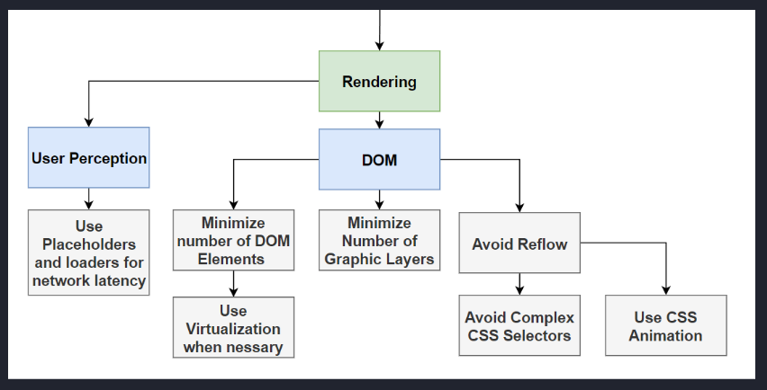
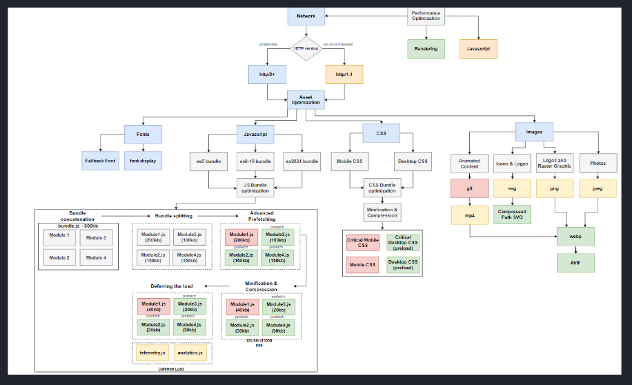
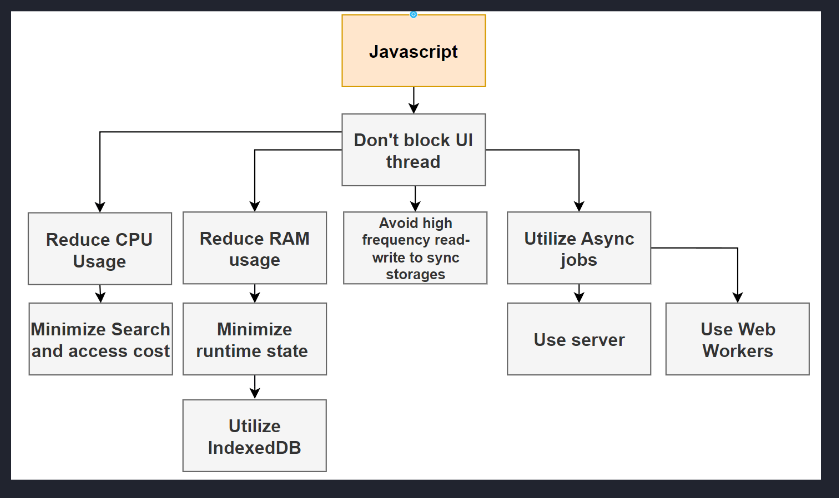
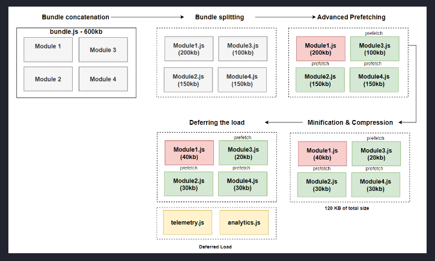

---
prev:
    text: Networking
    link: /docs/networking
---

<!-- markdownlint-disable MD007 MD010 MD013 MD024 MD033 -->

<script setup>
import DocHeading from "../components/doc-heading.vue"
</script>

# Web application performance

<DocHeading />

[[toc]]

<hr>

In this module, we'll cover:

- Web Vitals
- Network performance
- JavaScript optimizations
- CSS optimizations

## Web Vitals

### Summary of rendering optimization

1. User perception is more important than rendering metrics
    1. Utilize placeholder, load indicators, etc.
2. DOM
    1. Minimize the number of DOM elements
        1. Use virtualization when necessary
    2. Minimize number of grapic layers
    3. Avoid reflow
        1. Avoid complex CSS selectors
        2. Use CSS animation
        3. Utilize `DocumentFragment` to apply multiple changes to the DOM instead of making many changes to the DOM, which triggers multiple reflows
        4. Utilize stacking contexts to remove components from the normal flow to avoid reflows when making changes to said component's DOM tree



### LCP (largest contentful paint)

**What it measures**: loading performance
**Goal**: <= 2.5 seconds of page load start
**Ruh-roh**: 4s

### INP (interactive to next paint)

**What it measures**: interactivity
**Goal**: <= 200ms
**Ruh-roh**: 500ms

### CLS (cumulative layout shift)

**What it measures**: visual stability
**Goal**: <= 0.1
**Ruh-roh**: 0.25

## Network performance

### Summary

1. Optimize assets
    1. Fonts
        1. Fallback font
        2. `font-display`
    2. JavaScript
        1. Multi-bundle optimization
            1. Code splitting
            2. Minification and compression
            3. Prefetch/preload
            4. Deferring loading
    3. CSS
        1. Define and inline critical mobile and desktop styles
        2. Bundle optimization
            1. Code splitting
            2. Minification and compression
    4. Images
        1. Use the correct format for the intended asset usage
        2. Use compressed images



### Choosing the right protocol

Server protocal usage today:

- http/1.1 --> ~20%
- http/2 --> ~50%
- http/3 --> ~30%

#### HTTP/1.1

##### Loading efficiency limitation

**How HTTP/1.1 serves HTML:**

1. Client requests HTML page
2. Server responds with the request page
3. Browser starts to render the web page and sequentially load every resource
4. Browser pauses rendering to execute asynchronous scripts once they're done loading
5. Page is rendered only when critical resources on the HTML page are fully loaded
6. After rendering is complete, browser will start executing additional requests mae by deferred scripts

##### Data overhead

~50kb added overhead per request regardless of the actual request body...

```text
GET /page.html HTTP/1.1

Accept: text/html,application/xhtml+xml,image/jxr/,*/*
Accept-Encoding: gzip, deflate, br
Accept-Language: en-GB,en-US;q=0.8,en;q=0.6
Host: www.frontend-engineer.com
User-Agent: Chrome 1.1
```

##### Maintenance cost

HTTP/1.1 servers cost more for business in the long run.

#### Benefits of HTTP/2 and HTTP/3

##### Multiplexing

Multiple streams can be enabled per TCP connection, which means you don't have to perform the triple handshake each time you make a new request.

###### Header compression

HTTP/2+ provides 98% header compression.

| Protocol | Overhead |
|--|--|
| HTTP/1.1 | 5kb |
| HTTP/2 | 12.5 bytes |

#### Benefits of SSE

[TBD]

## JavaScript optimizations

There is one basic rule to always follow:

**Do not block the UI thread**

Core JS, the core of JavaScript's source code, is **243.9kb** minified, and **74.1kb** minified + gzipped.

Guess the bundle size: `"FrontendMasters".matchAll(/Frontend/)`

| Function | ES5 Bundle Size | ES2020 Bundle Size |
|--|--|--|
| `String.prototype.matchAll` | 16.9kb | 69b |

Other optimizations include:

1. Reduce CPU usage
    1. Minimize access and search cost by utilizing Normalization of your data structures (2NF)
2. Reduce RAM usage
    1. Minimize running state by utilizing the Web Storage API and IndexedDB to offload state from the memory to the hard drive
3. Avoid high frequency read-write to synchronous storages, such as local and session storage
4. Utilize asynchronous jobs
    1. Server
    2. Web workers
5. Defer script loading and execution
6. Utilizing `DocumentFragment` for appending multiple items to the dom without causing O(N) reflows



### Overview of the performance gains by utilizing the below optimizations

There are four techniques we can use to optimizing our JavaScript bundles and improve page load performance. In order of implementation:

1. Code splitting
2. Minification and compression
3. Prefetching
4. Deferring execution



### Polyfills... do you actually need them?

- ES6 (2016) has support of 98.2% of browsers
    - constants
    - Array functions
    - Default parameters to functions
    - Destructuring
    - ES6 classes
    - Spread operator
    - New for loops
    - Variable and functional scopes
    - import and export
    - Variable declaration let and var
    - Multi-line strings
    - Object literal syntax
    - JavaScript Promise
- ES7-10 (2016 - 2019) has support of 96% of browsers
    - Array includes
    - ** exponential operator
    - Exponential assignment operator **=
    - Class properties
    - Promise finally block
    - Asynchronous iteration
    - REST/spread operator enhancement
    - Regexpression update
    - BigInt primitive type
    - Dynamic imports
    - JSON stringify enchanced to support unicode
    - Array.Flat methods
    - String.trim methods
    - Object.fromEntries
    - Global this object
    - toString()
    - `Symbol.prototype.description`
    - Optional catch binding
- ES11 (2020) - 90%
    - `Promise.allSettled`
    - Nullish Coalescing
    - Optional chaining operator
    - Private class variables
- ES12 (2021) - 89%
    - `String.prototype.replaceAll`
    - `WeakRefs`
    - Logical assignment operators 
    - Numeric separators
    - `Promise.any`

#### Multi-bundle approach

Process of compiling JavaScript into multiple bundles and enabling the server to serve the bundle most optimized based on the `user-agent`.

### Code splitting

Process of importing modules only when needed.

Instead of having a concatenated bundle size of 1mb, we can split it into four modules of 250kb, or whatever, to reduce rendering performance and CPU and memory usage.

```ts
const cta = document.getElementById("next-button")

cta.addEventListener("click", async () => {
    const { render } = await import("./module.js")
    render(root)
})
```

#### Code pre-fetch

Browsers provide the ability to link to resources we want to preload in the background.

`<link rel="preload" href="./module1.js">` --> preloads a resource in the background with a high priority
`<link rel="prefetch" href="./module2.js">` --> preloads and caches a resource in the background with a low priority

### Code minification and compression

#### Minification

Process of simplify code syntax to remove unnecessary characters and shorten text to create smaller file sizes:

```ts
// Unminified
function Sum() {
    const longVAriableName = 2 + 2
    return longVAriableName
}

// Minified
function s(){return 2+2}
```

#### Compression

There are two compression options, but older browsers may limit the use of **brotli** over **gzip**.

| Library | Algorithm | Initial Size | Compressed | Ratio |
| --------------- | --------------- | --------------- | --------------- | --------------- |
| jquery-3.7.1.js | Brotli | 302kb | 69kb | 77% |
| jquery-3.7.1.js | gzip | 302kb | 83kb | 73% |
| jquery.3.7.1.min.js | Brotli | 85kb | 27kb | 68% |
| jquery.3.7.1.min.js | gzip | 85kb | 30kb | 65% |

**Brotli**, on average, is 20-30% faster than **gzip** but is less likely to be supported by older browsers.

**Gzip** is much faster and supported by most browsers.

### Prefetching

[TBD]

### Defer script loading and execution

Deferred loading is the ability to asynchronously load javascript in the background and defer execution until the browser has finished parsing the DOM.

**Note**
`async` scripts execute once fully downloaded, regardless of whether the browser has finished parsing the DOM.

### Utilizing `DocumentFragment`

[TBD]

## CSS optimizations

There are six optimizations we can utilize:

1. Split the bundle when necessary
2. Minify and compress
3. Inline critical styles
4. Preload/prefetch non-critical styles in the background
5. Utilizing stacking contexts to minimize DOM

### Code splitting

Same as with JavaScript modules. This is largely handled by JavaScript build tools, such as Webpack or Vite, but we should stil write our CSS within small modules.

### Minification and compression

| Uncompressed | Minified | Gzip | Brotli |
| ------------- |--|--|--|
| 2413.4kb | 1967.4kb | 190.2kb | 46.2kb |

### Critical style extraction

There are two types of styles within an app:

- **Critical**: the app cannot render or used properly without
- **Non-critical**: popups, advanced graphic features, inactive pages, etc. prettttty buttons

Typically, this takes the form of:

```html
<!-- Non-optimized -->
<html>
    <head>
        <link rel="stylesheet" href="./desktop.css" />
    </head>
    <!-- ... -->
</html>

<!-- Optimized -->
<html>
    <head>
        <style>
            #root {
                // Critical Styles
            }
        </style>

        <!-- Two options for fetching non-critical styles -->
        <!-- media="print" only fires the request once the whole page has been rendered -->
        <link rel="stylesheet" href="./non-critical.css" media="print" onload="this.media='all'" />
        <link rel="preload" as="style" href="./non-critical.css" />
    </head>
    <!-- ... -->
</html>
```

### Preloading/fetching non-critical styles

[TBD]

### Stacking contexts

[TBD]
