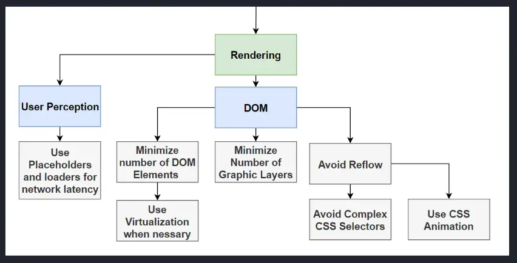

<!-- markdownlint-disable MD007 MD010 MD013 MD024 MD033 MD041 -->
[Web Vitals](https://web.dev/articles/vitals) are how we measure rendering performance.

### Summary of rendering optimization

1. User perception is more important than rendering metrics
    1. Utilize placeholder, load indicators, notifications, messaging, etc.
1. DOM
    1. Minimize the number of DOM elements
        1. Use virtualization when necessary
    1. Minimize number of grapic layers
    1. Avoid reflow
        1. Avoid complex CSS selectors
        1. Avoid animating or transitioning elements in the normal flow
        1. Use CSS animation
        1. Utilize `DocumentFragment` to apply multiple changes to the DOM instead of making many changes to the DOM, which triggers multiple reflows
        1. Utilize stacking contexts to remove components from the normal flow to avoid reflows when making changes to said component's DOM tree

### LCP (largest contentful paint)

| What it measures | |
|---|---|
| What it measures | loading performance |
|  Goal |  <= 2.5 seconds of page load start  |
|  Ruh-roh |  4s  |

### INP (interactive to next paint)

| What it measures | |
|---|---|
| What it measures | interactivity |
|  Goal |  <= 200ms |
|  Ruh-roh |  500ms  |

### CLS (cumulative layout shift)

| What it measures | |
|---|---|
| What it measures | visual stability |
|  Goal |  <= 0.1 |
|  Ruh-roh |  0.25  |
